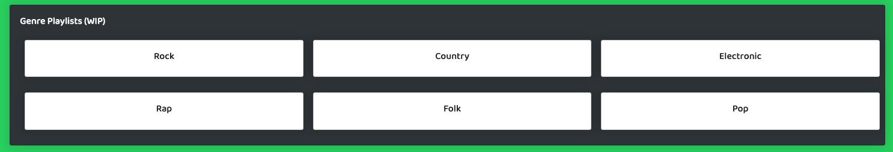

# 

## Description

An application utilizing TheAudio_DB to allow users to search musical artists and return data such as biographical information, genre, top songs, song description, music videos, social media links, and images. This is Project 2 for UCF's Fullstack Coding Bootcamp. Contributors include Carlito Algarin, Nicolas Fontan, Tanner Schenck, and Bridget Shannon.

## Languages

## Features

- When users arrive at the home page, there is a carousel of featured artists for musical inspiration and a list of Top 20 Songs to choose from:

  

- When a user searches for a musical artist, they are presented with artist information and an option to save the artist to their member page. When a user clicks on a top song from an artist, song information will display on the page. Users have the option to save the song to their profile in either a "saved songs" list or a "listen to later" list. When a user is logged in, their email is displayed in the navbar.

  

## Work in Progress

The following features of the Audiophyle application are works in progress or (WIP).

- When a user arrives at the home page, there is a Genre Playlists section. When a genre is clicked,the user will be taken to a playlist of songs based on that genre. We can incorporate this feature using the Spotify API.

  

- When a user arrives at the member page, there is a Band Merchandise section. Ideally the user can select one of there saved artists and the band merchandise links will populate with links to shirts, vinyls, and posters. We can incorporate this feature using The Bands In Town API.

  

- When a user arrives at the member page, there is an Upcoming Events section. Ideally the user can select one of there saved artists and upcoming events will populate with links to shows, tour dates, and artist website. We can incorporate this feature using The Bands In Town API.

  

  ## Deployment & Repository

- Heroku: https://audiophyle-music-platform.herokuapp.com/
- GitHub: https://github.com/tintin92/Audiophyle
